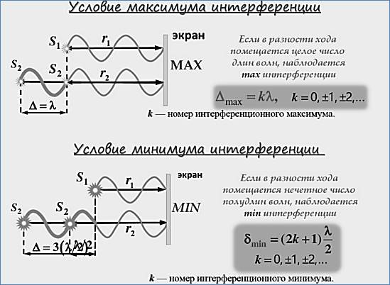

$\epsilon_0 = 8{,}85 \cdot 10^{-12} \, \frac{\text{Ф}}{\text{м}}$

$\mu_0 = 4\pi \cdot 10^{-7} \, \frac{\text{Гн}}{\text{м}}$

$$\frac{1}{\sqrt{\epsilon_0 \cdot \mu_0}} = 299\,863\,380{,}5 \, \frac{\text{м}}{\text{с}} = c \text{ (скорость света)}$$

### Основные формулы интерференции света

**Длина когерентности** $l_{ког}$

$$l_{ког} = c \cdot t_{ког}$$

где

$t_{ког}$ — время когерентности

**Оптическая длина пути света**

$$L = n \cdot S$$

где

$n$ — показатель преломления среды

$S$ — геометрическая длина пути

**Оптическая разность хода двух лучей**

$$\Delta = L_2 - L_1$$

$L_1, L_2$ — оптические длины пути

**Разность фаз двух когерентных волн**

$$\delta = \frac{2\pi}{\lambda_0} \cdot \Delta$$

где

$\lambda_0$ — длина волны в вакууме

$\Delta$ — оптическая разность хода лучей

**Условие интерференционного максимума**

$$\Delta = \pm \, m\lambda_0 \quad (m = 0, 1, 2, \dots)$$

**Условие интерференционного минимума**

$$\Delta = \pm \, (2m + 1)\frac{\lambda_0}{2}$$

**Ширина интерференционной полосы**

$$\delta_0 = \lambda_0 \cdot \frac{l}{d}$$

где

$d$ — расстояние между когерентными источниками волн

$l$ — расстояние до экрана $(l \gg d)$

### Задание

Когерентные лучи с $\lambda_0 = 600 \text{ нм}$ приходят в одну точку пространства с геометрической разностью хода $\Delta s = 1{,}2 \text{ мкм}$. Определить, максимум или минимум интерференционной картины наблюдается в этой точке, если лучи проходят:

а) в воздухе ($n_1 = 1$)

б) $n_2 = 1{,}75$

в) $n_3 = 1{,}5$

---

### Решение

Оптическая разность хода:

$$\Delta = n \cdot \Delta s$$

Условие максимума: $\Delta = m\lambda_0$ (целое $m$)

Условие минимума: $\Delta = (2m+1)\frac{\lambda_0}{2}$ (полуцелое $\frac{\Delta}{\lambda_0}$)

**а)** $n_1 = 1$

$$\Delta = 1 \cdot 1200 \text{ нм} = 1200 \text{ нм}$$

$$\frac{\Delta}{\lambda_0} = \frac{1200}{600} = 2$$

$m = 2$ — целое число → **максимум**

**б)** $n_2 = 1{,}75$

$$\Delta = 1{,}75 \cdot 1200 \text{ нм} = 2100 \text{ нм}$$

$$\frac{\Delta}{\lambda_0} = \frac{2100}{600} = 3{,}5 = \frac{2 \cdot 3 + 1}{2}$$

$m = 3$ — полуцелое число → **минимум**

**в)** $n_3 = 1{,}5$

$$\Delta = 1{,}5 \cdot 1200 \text{ нм} = 1800 \text{ нм}$$

$$\frac{\Delta}{\lambda_0} = \frac{1800}{600} = 3$$

$m = 3$ — целое число → **максимум**

---

### Задание 2

Определить значение токов прямого смещения p-n перехода, если $I_0(T_0) = 25 \text{ мкА}$, $T_0 = 300 \text{ К}$, для Ge $\alpha = 0{,}09 \text{ К}^{-1}$.

$$I_{пр} = I_0(T_0) \cdot e^{\alpha \cdot \Delta T}$$

где $\Delta T = T - T_0$

Рассчитать для: $T_1 = 305 \text{ К}$, $T_2 = 310 \text{ К}$, $T_3 = 315 \text{ К}$

---

### Решение

**а)** $T_1 = 305 \text{ К}$, $\Delta T = 305 - 300 = 5 \text{ К}$

$$I_{пр} = 25 \cdot e^{0{,}09 \cdot 5} = 25 \cdot e^{0{,}45} = 25 \cdot 1{,}568 \approx 39{,}21 \text{ мкА}$$

**б)** $T_2 = 310 \text{ К}$, $\Delta T = 310 - 300 = 10 \text{ К}$

$$I_{пр} = 25 \cdot e^{0{,}09 \cdot 10} = 25 \cdot e^{0{,}9} = 25 \cdot 2{,}460 \approx 61{,}49 \text{ мкА}$$

**в)** $T_3 = 315 \text{ К}$, $\Delta T = 315 - 300 = 15 \text{ К}$

$$I_{пр} = 25 \cdot e^{0{,}09 \cdot 15} = 25 \cdot e^{1{,}35} = 25 \cdot 3{,}857 \approx 96{,}44 \text{ мкА}$$

---

### Задание 3

Для p-n перехода на SiC, который имеет $n_i = 2 \cdot 10^8 \text{ см}^{-3}$ при $T = 300 \text{ К}$, удельное сопротивление p-области $\rho_p = 3{,}3 \text{ Ом·см}$, а n-области $\rho_n = 1{,}6 \text{ Ом·см}$.

Определить для равновесного состояния контактную разность потенциалов $\varphi_к$ и ширину перехода $d$, если подвижность электронов $\mu_n = 100 \text{ см}^2/(\text{В·с})$, а дырок $\mu_p = 10 \text{ см}^2/(\text{В·с})$.

---

### Решение

**1. Концентрации основных носителей**

Для n-области:

$$n_n = \frac{1}{q \cdot \rho_n \cdot \mu_n} = \frac{1}{1{,}6 \cdot 10^{-19} \cdot 1{,}6 \cdot 100} = 3{,}91 \cdot 10^{16} \text{ см}^{-3}$$

Для p-области:

$$p_p = \frac{1}{q \cdot \rho_p \cdot \mu_p} = \frac{1}{1{,}6 \cdot 10^{-19} \cdot 3{,}3 \cdot 10} = 1{,}89 \cdot 10^{17} \text{ см}^{-3}$$

**2. Контактная разность потенциалов**

$$\varphi_к = \frac{kT}{q} \cdot \ln\frac{n_n \cdot p_p}{n_i^2}$$

$$\varphi_к = 0{,}026 \cdot \ln\frac{3{,}91 \cdot 10^{16} \cdot 1{,}89 \cdot 10^{17}}{(2 \cdot 10^8)^2} = 0{,}026 \cdot \ln(1{,}85 \cdot 10^{17}) = 0{,}026 \cdot 39{,}76 \approx 1{,}03 \text{ В}$$

**3. Ширина p-n перехода**

$$d = \sqrt{\frac{2 \varepsilon \varepsilon_0 \varphi_к}{q} \left(\frac{1}{n_n} + \frac{1}{p_p}\right)}$$

где $\varepsilon = 10$ — диэлектрическая проницаемость SiC, $\varepsilon_0 = 8{,}85 \cdot 10^{-14} \text{ Ф/см}$

$$d = \sqrt{\frac{2 \cdot 10 \cdot 8{,}85 \cdot 10^{-14} \cdot 1{,}03}{1{,}6 \cdot 10^{-19}} \left(\frac{1}{3{,}91 \cdot 10^{16}} + \frac{1}{1{,}89 \cdot 10^{17}}\right)} \approx 1{,}88 \cdot 10^{-5} \text{ см} \approx 0{,}19 \text{ мкм}$$