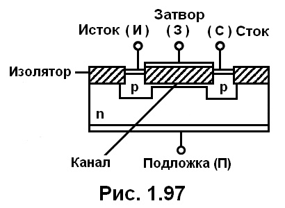

# Приёмники излучения

Приёмники делятся на 2 класса:
- тепловые
- фотонные

## Тепловые приёмники

К тепловым приёмникам излучения относятся:

1. **Пироэлектрические приёмники** — основаны на генерировании тока в цепи в результате нагрева при облучении. Их ещё называют термоэлектрическими генераторами тока.

2. **Термоэлементы** — устройства, использующие спай разнородных проводников, создающих термо-ЭДС при нагреве в результате облучения. Это тепловые генераторы напряжения.

3. **Болометры** — термочувствительные резисторы, у которых происходит изменение сопротивления при поглощении потока излучения.

## Фотонные приёмники

1. **Приёмники с внешним фотоэффектом** — особенность работы таких приёмников заключается в испускании (эмиссии) электронов с поверхности фоточувствительного элемента под действием падающего излучения. 

Устройства: 

- фотоэлектронные умножители — электровакуумные приборы, в которых поток электронов, испускаемых фотокатодом под действием оптического излучения, усиливается в умножительной системе за счёт вторичной электронной эмиссии. Такие приборы необходимы для наблюдения быстропротекающих процессов.

- электрооптические преобразователи — электровакуумные приборы, преобразующие изображения, создаваемые на фотокатоде рентгеновским, ультрафиолетовым, инфракрасным излучением, в электронное видимое изображение на флуоресцирующем экране. Такое преобразование необходимо для переноса изображения из одного спектрального диапазона (невидимое изображение) в другой (видимое изображение).

2. **Приёмники со внутренним фотоэффектом** — наблюдается при облучении полупроводникового вещества, внутри которого увеличивается количество свободных носителей заряда и повышается проводимость данного прибора. К этим приборам относятся фотодиоды, фоторезисторы. Для приёмников с внутренним фотоэффектом необходимо определять темновой ток — ток, протекающий через фотоприёмник в отсутствие облучения. Он обусловлен термогенерацией носителей заряда и определяет нижний порог обнаружения оптического сигнала.

### Электроннолучевые приёмники с внешним и внутренним фотоэффектом

Устройства: видикон, секон, плюмбикон, кремнекон, диссектор.

- **Видиконы** — прямопередающие телевизионные трубки, считывание информации с которых происходит сканированием растра. В выходной цепи формируется электрический сигнал, параметры которого определяются степенью освещённости отдельных участков видикона. Видиконы имеют хорошую чувствительность и высокую разрешающую способность — до 6000 линий.

- **Диссекторы** — разновидность видикона, применяются в системах технического зрения. Достоинства — высокая скорость считывания и возможность организации нерегулярной развёртки.

- **Секоны** — передающие телевизионные трубки, в которых изображение формируется за счёт вторичных электронов. Достоинства: малая инерционность, что позволяет передавать изображение движущихся объектов. Разрешающая способность — до 12 тыс. линий. Недостаток — образование на изображении пятен и полос из-за неоднородности структуры мишени.

- **Плюмбиконы** — имеют фотодиодную мишень с PIN-структурой, которая обеспечивает малую инерционность и линейную световую характеристику.

- **Кремнеконы** — имеют фотодиодную матричную мишень, состоящую из нескольких сотен тысяч кремниевых диодов. По сравнению с плюмбиконом кремнекон имеет большую чувствительность и больший динамический диапазон.

## МДП-транзистор (металл-диэлектрик-полупроводник)

МДП-транзистор (также MOSFET) — полевой транзистор с изолированным затвором. Основные элементы структуры:

- **Исток (И)** — электрод, из которого носители заряда поступают в канал
- **Затвор (З)** — управляющий электрод, отделённый от полупроводника слоем изолятора (оксида). Напряжение на затворе управляет проводимостью канала
- **Сток (С)** — электрод, через который носители заряда покидают канал
- **Изолятор** — диэлектрический слой (обычно $SiO_2$), разделяющий затвор и полупроводник
- **Канал** — область между истоком и стоком, в которой протекает ток. Формируется под действием напряжения на затворе
- **Подложка (П)** — полупроводниковая основа (на схеме — n-типа с p-областями истока и стока)

**Принцип работы**: при подаче напряжения на затвор в приповерхностном слое полупроводника под изолятором формируется инверсионный канал (в данном случае p-канал между p-областями истока и стока в n-подложке), по которому протекает ток от истока к стоку. Величина тока управляется напряжением на затворе.

## ПЗС (прибор с зарядовой связью, CCD)

ПЗС (англ. CCD — Charge-Coupled Device) — полупроводниковый прибор для преобразования оптического изображения в электрический сигнал. Основан на структуре МДП-конденсаторов.

**Устройство**: матрица МДП-элементов (пикселей) на общей полупроводниковой подложке. Каждый пиксель — МДП-конденсатор: металлический электрод, слой изолятора ($SiO_2$), полупроводник.

**Принцип работы**:

1. **Накопление заряда** — фотоны генерируют электронно-дырочные пары в полупроводнике (внутренний фотоэффект). Под электродом с напряжением образуется потенциальная яма, в которой накапливаются фотоэлектроны. Заряд пропорционален интенсивности света.

2. **Перенос заряда** — зарядовые пакеты последовательно передаются от элемента к элементу переключением напряжений на соседних затворах (заряд «перетекает» между потенциальными ямами — отсюда название «зарядовая связь»).

3. **Считывание** — на выходе матрицы зарядовые пакеты поступают на усилитель и преобразуются в видеосигнал.

**Схема трёхфазного переноса заряда (по рисунку)**:

- Слева — структура ПЗС: на подложке p-типа через слой изолятора ($SiO_2$) расположены электроды с чередующимися фазами $\varphi_1$, $\varphi_2$, $\varphi_3$
- Справа — временные диаграммы трёхфазных тактовых импульсов $\varphi_1$, $\varphi_2$, $\varphi_3$, управляющих переносом заряда

Перенос происходит следующим образом: в начальный момент заряд находится под электродом $\varphi_1$ (высокий уровень напряжения). Затем напряжение подаётся на $\varphi_2$ — потенциальная яма расширяется, и заряд перетекает под электрод $\varphi_2$. После снятия напряжения с $\varphi_1$ заряд полностью оказывается под $\varphi_2$. Аналогично заряд передаётся на $\varphi_3$ и далее — на следующий $\varphi_1$. Так зарядовые пакеты последовательно сдвигаются вдоль матрицы к выходному усилителю.

**Достоинства**: высокая чувствительность, низкий уровень шумов, линейная зависимость сигнала от освещённости.

## Оптроны

**Оптроны** — полупроводниковые приборы, содержащие источник излучения и фотоприёмник. Предназначены для гальванической развязки электрических цепей между собой.