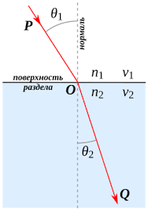

# Преломление света. Закон Снеллиуса

## Преломление на границе двух сред

На рисунке изображено преломление светового луча на плоской границе раздела двух сред с показателями преломления $n_1$ и $n_2$ (скорости света в средах $v_1$ и $v_2$ соответственно).

- Луч света распространяется из точки **P** в среде 1 и падает на поверхность раздела в точке **O**.
- $\theta_1$ --- угол падения (угол между падающим лучом и нормалью к поверхности).
- Преломлённый луч уходит в среду 2 к точке **Q**.
- $\theta_2$ --- угол преломления (угол между преломлённым лучом и нормалью).

### Закон Снеллиуса

$$n_1 \sin\theta_1 = n_2 \sin\theta_2$$

Поскольку показатель преломления связан со скоростью света в среде как $n = c / v$, закон можно записать в эквивалентной форме:

$$\frac{\sin\theta_1}{\sin\theta_2} = \frac{n_2}{n_1} = \frac{v_1}{v_2}$$

При переходе луча из оптически менее плотной среды ($n_1 < n_2$) в более плотную угол преломления $\theta_2 < \theta_1$ --- луч отклоняется к нормали. При переходе в менее плотную среду --- наоборот, луч отклоняется от нормали.

## Преломление и полное внутреннее отражение в призме

На рисунке показаны два режима прохождения параллельных лучей (1, 2, 3) через стеклянную призму:

- **а) Преломление через призму.** Лучи входят в призму через левую грань, преломляются на входе, проходят через призму и выходят через нижнюю грань (гипотенузу), снова преломляясь. Порядок лучей сохраняется: 1, 2, 3.

- **б) Полное внутреннее отражение.** Лучи входят через левую грань, но при падении на гипотенузу угол падения превышает предельный угол полного внутреннего отражения. Лучи отражаются от гипотенузы (заштрихованная область) и выходят через правую грань. При этом порядок лучей меняется на обратный: 3, 2, 1.

Предельный угол полного внутреннего отражения определяется из закона Снеллиуса при $\theta_2 = 90°$:

$$\sin\theta_{\text{пр}} = \frac{n_2}{n_1}$$

Полное внутреннее отражение возможно только при переходе из оптически более плотной среды в менее плотную ($n_1 > n_2$) и при угле падения $\theta_1 > \theta_{\text{пр}}$.

## Тонкая линза

На рисунке показаны основные характеристики двух типов тонких линз:

### а) Собирающая линза (выпуклая)

Параллельные лучи, идущие вдоль главной оптической оси, после преломления в линзе сходятся в **главном фокусе** $F$ (действительный фокус). Основные элементы:

- **Главная оптическая ось** --- прямая, проходящая через центры кривизны обеих поверхностей линзы.
- **Главная плоскость** --- плоскость, перпендикулярная главной оси и проходящая через оптический центр линзы.
- **Главный фокус** $F$ --- точка на главной оси, в которой собираются лучи, падающие параллельно главной оси.
- **Побочный фокус** $F'$ --- фокус для лучей, падающих параллельно побочной оптической оси.
- **Фокальная плоскость** --- плоскость, проходящая через фокус перпендикулярно главной оси; в ней лежат все побочные фокусы.
- **Фокусное расстояние** $f$ --- расстояние от оптического центра линзы до главного фокуса.

### б) Рассеивающая линза (вогнутая)

Параллельные лучи после преломления расходятся так, что их продолжения пересекаются в **мнимом фокусе** $F$ (расположен по ту же сторону, откуда падает свет). Элементы те же, но фокус --- мнимый.

### Формула тонкой линзы

$$\frac{1}{f} = \frac{1}{d} + \frac{1}{d'}$$

где $d$ --- расстояние от предмета до линзы, $d'$ --- расстояние от линзы до изображения, $f$ --- фокусное расстояние.

Оптическая сила линзы:

$$D = \frac{1}{f} \quad [\text{дптр}]$$

Для собирающей линзы $f > 0$, для рассеивающей $f < 0$.
